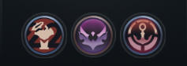

# Tokens-au-bucher

C'est un truc qui permet d'enlever les tokens des challenges sur ton profil, les machins que tu ne peux pas enlever depuis ton client.



C'est grave (vraiment très) inspiré de [ChallengesAreEvil](https://github.com/MaciejGorczyca/ChallengesAreEvil), sauf que je l'ai refait en Go, avec des commentaires en FR pour que vous puissiez comprendre ^^.

## P'tit tuto

1. Tu ouvres le client.
2. Tu télécharges `tokens-au-bucher.exe` depuis le lien [latest release](https://github.com/PolytopeZ/tokens-au-bucher/releases/latest).
3. Tu double-cliques dessus.

Si tu vois ce message, c'est que ça s'est bien passé:
```
C'est bon c'est fait, appuie sur entree !!!
```
T'as Windows qui va te crier dessus, c'est normal j'ai pas envie de claquer 200 balles dans un certificat de signature.

## Mais dis-moi Jamy, comment ça marche ton truc ?

Le client League (`LeagueClientUx.exe`) fait tourner un serveur HTTPS local sur `127.0.0.1`. 
À chaque lancement, il va choisir un port et un token d'authentification qui sont random, faut donc les trouver.

L'outil va:
1. Chercher le process `LeagueClientUx.exe`.
2. Extraire `--app-port` et `--remoting-auth-token` (qui sont le port et le token d'authentification).
3. Envoyer une requête `POST /lol-challenges/v1/update-player-preferences/` avec `{"challengeIds":[]}` ([] = liste vide = pas de tokens de challenge).

Le client n'est pas modifié.

## Est-ce safe ?

- C'est local seulement (`127.0.0.1`), pas de données qui partent sur un serveur du Pakistan ou quoi que ce soit.
- Open source, 80 lignes dans le fichier : [main.go](main.go). Tu peux demander à ton poto Claude ou GPT de lire pour toi.
- Basé sur [ChallengesAreEvil](https://github.com/MaciejGorczyca/ChallengesAreEvil) où aucun ban n'a été recensé.

Je le redis, mais t'as Windows qui va te crier dessus, c'est normal j'ai pas envie de claquer 200 balles dans un certificat de signature.
Tu vas avoir un truc style :
> *Windows SmartScreen may warn "Unknown publisher" — the binary is not code-signed.*

Tu cliques sur **More info → Run anyway**.
Ou alors tu le build toi-même (jt'explique en dessous).

## Build toi-même

T'as besoin de [Go 1.22+](https://go.dev/dl/).

```powershell
git clone https://github.com/PolytopeZ/tokens-au-bucher.git
cd tokens-au-bucher
go build -trimpath -o tokens-au-bucher.exe
```

## Vérif du hash de l'exe

Chaque release `.exe` est faite avec GitHub Actions ([workflow](.github/workflows/release.yml)). Pour vérifier que le fichier que tu as téléchargé est bien le bon:

```powershell
Get-FileHash tokens-au-bucher.exe
```

Tu compares les SHA-256, si c'est le même, c'est bon.
